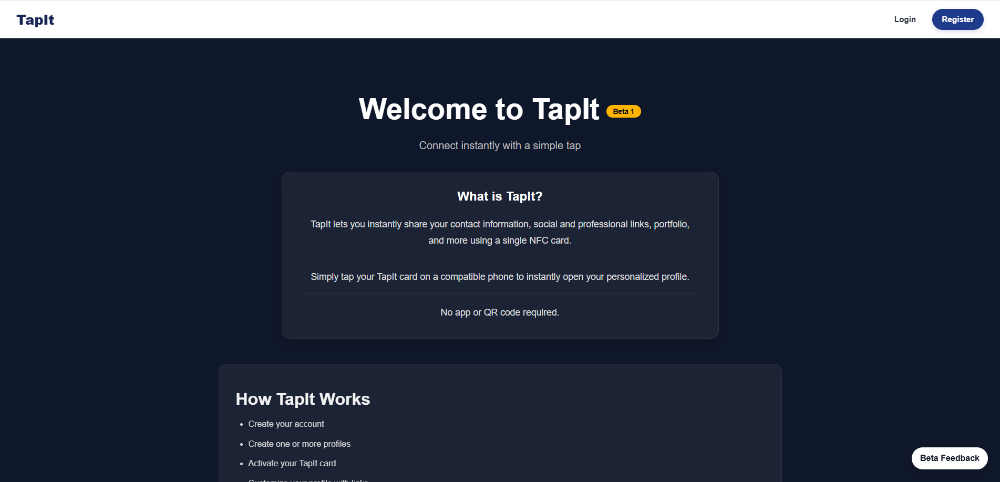
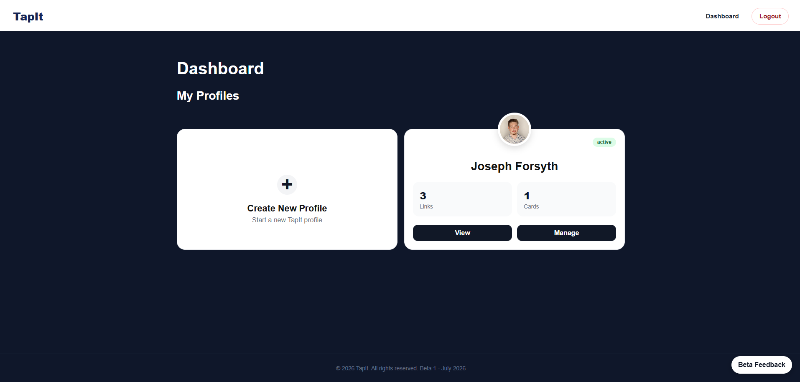
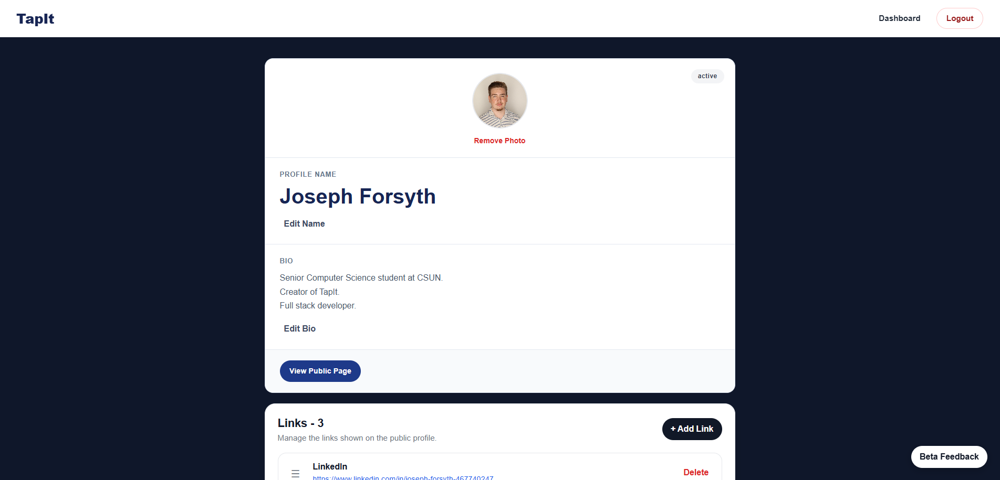
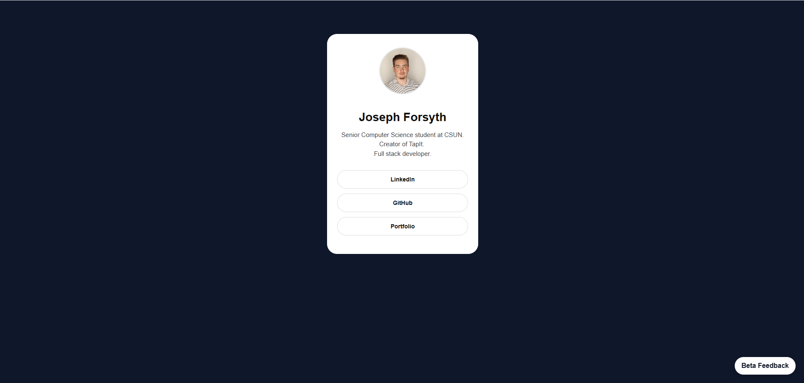

# TapIt

<p align="center">
  <strong>A modern NFC-powered digital business card platform built with React, FastAPI, and PostgreSQL.</strong>
</p>

TapIt is a full-stack web application that allows users to instantly share professional profiles, contact information, social links, portfolios, and more using a single NFC card—without requiring an app or QR code.

Designed with simplicity and scalability in mind, TapIt provides an intuitive platform for creating multiple public profiles, managing NFC cards, and sharing information seamlessly with a single tap.

---

## Why I Built TapIt

Traditional business cards quickly become outdated, are easy to lose, and often require manual data entry. While QR codes improve accessibility, they still require users to open their camera and scan.

TapIt was created to make networking faster and more seamless through NFC technology. A single tap immediately opens a customizable public profile where users can share the information they want, exactly how they want.

Beyond solving that problem, TapIt was intentionally built using technologies I had never previously worked with—including React, TypeScript, FastAPI, PostgreSQL, Supabase, and cloud deployment—to challenge myself and gain experience designing, building, deploying, and maintaining a production-style full-stack application from the ground up.

---

## Landing Page


## Dashboad


## Profile Management


## Public Profile


---

# Features

- 📱 NFC-powered profile sharing
- 👤 Multiple customizable public profiles
- 🔗 Drag-and-drop profile link management
- 🪪 NFC card activation workflow
- 🌐 Public profile pages
- 🖼️ Profile image uploads
- 🔒 Secure JWT authentication
- 📱 Responsive mobile-first design
- 💬 Built-in Beta Feedback system
- ⚡ FastAPI REST API backend
- ☁️ Cloud deployment with Firebase, Render, and Supabase

---

# Tech Stack

| Category | Technologies |
|----------|--------------|
| Frontend | React, TypeScript, React Router, CSS Modules |
| Backend | FastAPI, SQLAlchemy |
| Database | PostgreSQL |
| Authentication | JWT, Passlib |
| Storage | Supabase Storage |
| Deployment | Firebase Hosting, Render |
| Version Control | Git & GitHub |

---

# How It Works

1. Create a TapIt account.
2. Create one or more public profiles.
3. Customize each profile with links, images, and information.
4. Assign an NFC card to a profile.
5. Activate the card.
6. Anyone who taps the card is instantly taken to the selected public profile.

```
Create Account
      │
      ▼
Create Profile
      │
      ▼
Customize Profile
      │
      ▼
Assign NFC Card
      │
      ▼
Activate Card
      │
      ▼
Someone taps the card
      │
      ▼
Public Profile Opens
```

---

# Project Structure

```
tap-it/              
│
├── .tap-it-web       # React Frontend
│
├── .tap-it-server    # FastApi Backend
│
├── .tap-it-mobile    # Mobile App - in development

```

---

# Running Locally

### Clone the repository

```bash
git clone https://github.com/<your-username>/tap-it.git
```

### Frontend

```bash
cd tap-it-web

npm install

npm run dev
```

### Backend

```bash
cd tap-it-server

pip install -r requirements.txt

uvicorn app.main:app --reload
```

Additional setup instructions, environment variables, and deployment information are available in the **docs** folder.

### Pre-commit contract review (one-time setup)

This repo runs an AI-powered contract review (via the sibling `tap-it-ai-tools`
CLI) before any commit that touches `src/types`, comparing frontend
TypeScript types against backend Pydantic schemas in `tap-it-server`.
Requires `tap-it-ai-tools` cloned as a sibling directory
(`../tap-it-ai-tools`) with the `tapit-ai` CLI installed and on PATH.

One-time setup after cloning:

```bash
git config core.hooksPath scripts/hooks
```

---

<!-- # Documentation

Additional project documentation can be found in:

- Architecture Overview
- API Documentation
- Database Schema
- Local Development Setup
- Deployment Guide
- Environment Variables
- Beta 1 Release Notes
- Developer Design Notes

--- -->

# Current Status

**Current Version:** Beta 1

### Completed

- User Authentication
- Profile Management
- NFC Card Activation
- Public Profile Pages
- Profile Images
- Link Management
- Responsive Design
- Beta Feedback System
- Production Deployment

### Current Focus

- Documentation
- Performance Improvements
- Accessibility
- Production Polish

---

# Future Roadmap

## Phase 2A

- Admin Dashboard
- Rich Profile Content
- Public Profile Themes
- Analytics Dashboard
- Enhanced Card Management
- Additional Contact Modules
- Performance Improvements
- User Experience Enhancements

---

# Lessons Learned

Building TapIt has provided hands-on experience across the entire software development lifecycle, including:

- Designing scalable frontend architecture
- Building REST APIs with FastAPI
- Database design with PostgreSQL
- Authentication using JWT
- File storage with Supabase
- Cloud deployment
- Production debugging
- Accessibility improvements
- Performance optimization
- Production logging and rate limiting
- Full-stack application architecture

---

# Contact

If you'd like to learn more about TapIt or connect with me:

- LinkedIn: https://www.linkedin.com/in/joseph-forsyth-467740247/ 
- Portfolio Website: https://jgforsyth.com
- GitHub: https://github.com/jjforsyth15

---

# License

Copyright © 2026 Joseph Forsyth.

All rights reserved.

This project is currently proprietary and is not licensed for public redistribution or commercial use.


